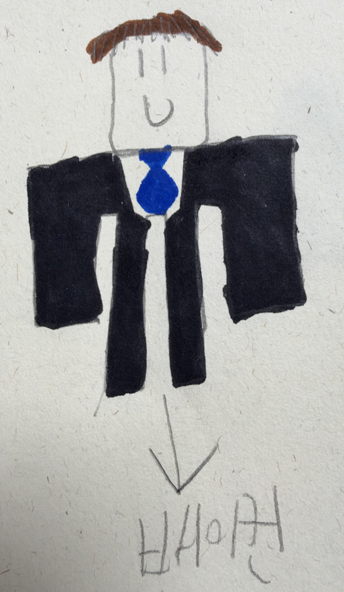
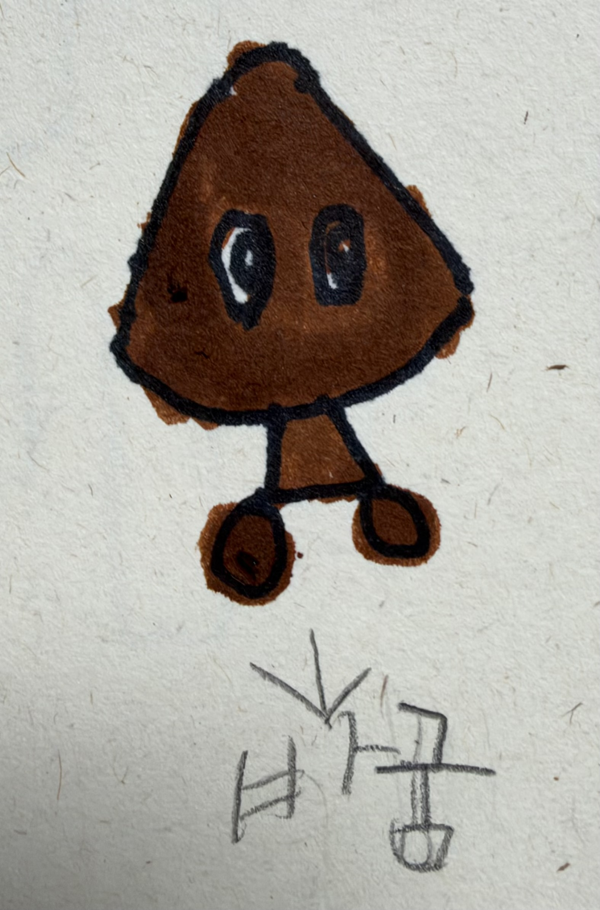
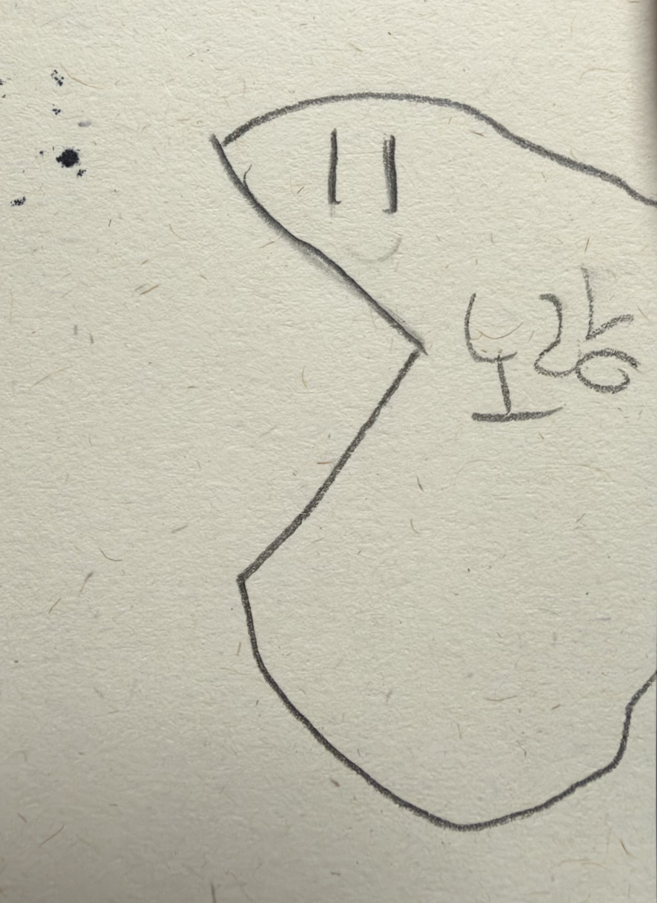
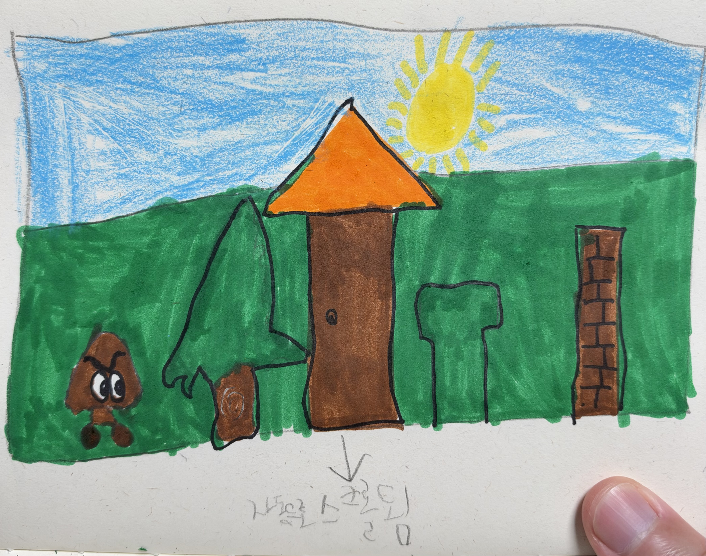

# 베이컨 먹방

> 정장을 입은 **베이컨**이 횡스크롤 맵을 점프로 헤쳐나가, 스테이지 끝에서 입을 벌리고
> 기다리는 **팩맨** 안으로 쏙 들어가는 게임.

초등학생 아이가 게임을 기획하고 캐릭터와 배경을 직접 그렸습니다.
설치할 것 없이 브라우저만 있으면 됩니다. PC와 모바일 모두, 세로·가로 어느 쪽으로도 플레이합니다.

> **🚧 개발 중입니다.** 지금은 수치를 맞춰보는 테스트 모드까지 만들어져 있습니다.
> 인트로·스테이지 진행·점수 화면은 아직 없습니다.

<br>

## 아이가 그린 그림

| 베이컨 | 바굼 | 팩맨 | 배경 |
|:---:|:---:|:---:|:---:|
|  |  |  |  |
| 주인공 | 적 | 골인 지점 | 배경과 장애물 4종 |

그림은 참고용으로 두고, 화면에 나오는 것은 전부 캔버스 코드로 다시 그렸습니다.
외부 이미지도 사운드 파일도 쓰지 않습니다.

<br>

## 어떤 게임인가

베이컨은 스스로 달리지 않습니다. **맵이 왼쪽으로 흘러오고, 조작은 점프 하나뿐**입니다.

- **점프** — 스페이스 / 엔터 / 화면 탭. 누르는 시간에 따라 높이가 달라집니다 (114u ~ 224u)
- **바굼** — 위에서 밟으면 납작해지고, 옆이나 아래로 닿으면 죽습니다
- **장애물** — 덤불, 벽돌 기둥, 토관, 침엽수. 옆구리에 부딪히면 즉사가 아니라 뒤로 밀리고,
  화면 왼쪽 끝까지 밀리면 그때 죽습니다. 밀리는 동안 다시 뛰어 빠져나올 수 있습니다
- **목숨 3개**, 죽으면 죽은 지점 조금 앞에서 다시 시작
- **스테이지 1~5**, 올라갈수록 스크롤이 빨라지고 장애물이 자주 나옵니다

<br>

## 만들면서 신경 쓴 것

**세로로도 가로로도 똑같이 공평하게.** 게임 로직을 전부 월드 유닛으로 계산하고 그릴 때만
픽셀로 바꿉니다. 그래서 세로든 가로든 **앞을 보는 거리가 900유닛으로 같고**, 장애물이
나타나는 타이밍이 동일합니다. 플레이 도중 폰을 돌려도 게임이 끊기지 않습니다.

**죽어도 배치는 그대로.** 스테이지 시작 전에 시드로 배치를 확정해두기 때문에, 죽어서
되돌아가도 장애물이 같은 자리에 있습니다. 외워서 깰 수 있습니다.

**깰 수 없는 구간은 안 나옵니다.** 랜덤 배치지만 점프로 넘을 수 있는 최소 간격을 강제합니다.
오토러너에서는 스크롤이 느릴수록 체공 중 이동 거리가 짧아 오히려 넘기 어려운데, 그 최악
조건(스테이지 1 × 침엽수)에 맞춰 장애물 크기를 역산했고 테스트로 못박아 두었습니다.

<br>

## 실행

```bash
node server.js      # 또는 실행.bat 더블클릭
```

http://localhost:8080 — 같은 와이파이의 폰에서 접속할 주소도 같이 출력됩니다.

```bash
npm test            # 41개
```

<br>

## 테스트 모드 조작

지금 열면 수치를 맞춰보는 화면이 뜹니다. 화면 버튼 또는 키보드로 바꿀 수 있습니다.

| | 키 | |
|---|---|---|
| 스테이지 ◀ ▶ | `1`~`5` | 속도와 장애물 빈도가 같이 바뀝니다 |
| 다시뽑기 | `R` | 같은 스테이지의 새 배치 |
| 점프 ◀ ▶ | `[` `]` | 5%씩 |
| 속도 ◀ ▶ | `-` `=` | 5%씩 |
| ▶▶ 다음 장애물 | `F` | 다음 장애물 앞으로 건너뜁니다 |
| 멈춤 / 재생 | `P` | |

<br>

## 기술 스택

순수 HTML5 Canvas + JavaScript (ES modules). 빌드 도구도 외부 라이브러리도 없습니다.
사운드는 Web Audio로 실시간 합성할 예정이라 오디오 파일도 없습니다.

설계 문서는 [`docs/superpowers/specs/`](docs/superpowers/specs/)에 있습니다.
